# Backend Architecture

_Generated by /architecture-map on 2026-08-18 — traced from code, not docs._

No `vercel.json` / cron config exists in this repo — every entry point below is
invoked manually (by a browser session, an admin action, or an external
pipeline calling in with a shared secret). No `trigger/*.ts` tasks exist either.

```mermaid
flowchart TD
    subgraph AUTH["Auth"]
        A1["GET /api/auth/callback"]
    end

    subgraph INGEST["Data ingestion (x-dashboard-key header)"]
        B1["POST /api/dashboard/upload-gl"]
        B2["POST /api/dashboard/upload-occupancy"]
        B3["POST /api/dashboard/upload-packet"]
        B4["GET /api/dashboard/upload-packet"]
    end

    subgraph LOCKING["Period locking (admin-role only)"]
        C1["POST /api/dashboard/lock-period"]
        C2["POST /api/dashboard/unlock-period"]
    end

    subgraph READ["Dashboard read + review (authenticated user)"]
        D1["GET /api/dashboard/data"]
        D2["POST /api/dashboard/gl-review"]
    end

    subgraph PDF["Packet PDF proxy"]
        E1["POST /api/dashboard/generate-packet-pdf"]
    end

    L1["lib/supabase/server.ts<br/>createServerSupabaseClient()<br/>(cookie-based, user session)"]
    L2["lib/supabase/server.ts<br/>createServiceClient()<br/>(service-role key, bypasses RLS)"]
    L3["lib/normalize-financial-data.ts<br/>normalizeFinancialData()"]

    SB[("Supabase<br/>Auth + Postgres")]
    RG[["External: report-generator service<br/>(REPORT_GENERATOR_URL)"]]

    A1 -->|"exchangeCodeForSession(code)"| L1
    L1 --> SB
    A1 -->|"redirect"| DASH["/dashboard"]

    B1 -->|"check x-dashboard-key"| L2
    B2 -->|"check x-dashboard-key"| L2
    B3 -->|"check x-dashboard-key"| L2
    B4 -->|"check x-dashboard-key... see mismatch note"| L2
    L2 --> SB
    B1 -->|"upsert monthly_financials<br/>(skip if locked)"| SB
    B2 -->|"upsert monthly_occupancy<br/>(skip if locked)"| SB
    B3 -->|"upsert monthly_packets"| SB
    B4 -->|"select monthly_packets"| SB

    C1 -->|"getUser()"| L1
    C2 -->|"getUser()"| L1
    C1 -->|"select profiles.role"| L2
    C2 -->|"select profiles.role"| L2
    C1 -->|"update monthly_financials.locked = true"| SB
    C2 -->|"update monthly_financials.locked = false"| SB

    D1 -->|"getUser()"| L1
    D1 -->|"select monthly_financials"| L2
    L2 --> SB
    D1 --> L3
    D2 -->|"getUser()"| L1
    D2 -->|"update monthly_financials<br/>gl_reviewed / gl_reviewed_by / gl_reviewed_at"| L2

    E1 -->|"fetch(reportGenUrl + /api/generate-financial-packet,<br/>x-internal-key header)"| RG
    RG -->|"PDF bytes"| E1
```

## Mismatches found (Step 2)

- **`upload-packet` GET has no auth check at all.** Unlike its sibling `POST` (and every other `x-dashboard-key`-gated ingestion route), the `GET` handler in `src/app/api/dashboard/upload-packet/route.ts` calls `createServiceClient()` directly with no `isAuthorized()` check — it's an unauthenticated read of all `monthly_packets` rows (or filtered by `location`/`month` query params). Diagrammed above with a "see mismatch note" edge label.
- **`generate-packet-pdf` is a pure network proxy, not a generator.** Its name suggests it builds the PDF; it actually does none of that — it forwards the request body verbatim to an external `report-generator` service (`REPORT_GENERATOR_URL`) and streams back whatever bytes that service returns. All real PDF logic lives outside this repo.
- **No cron/trigger infrastructure exists.** There's no `vercel.json` and no `trigger/*.ts` directory, so nothing in this repo fires on a schedule — every entry point is either browser-invoked (auth callback, dashboard reads, lock/unlock, gl-review) or invoked by an external pipeline holding `DASHBOARD_INTERNAL_KEY` (the three upload routes).

## Scope note

Traced 2-3 hops deep from each route: route → lib function → external service (Supabase table / external HTTP call). `lib/supabase/browser.ts` (`createBrowserSupabaseClient`) exists but is client-side only and not called from any route handler, so it's omitted from the backend graph. Frontend components that call these routes (e.g. dashboard pages under `src/app/dashboard`) were not traced — this map covers server-side backend flow only.
